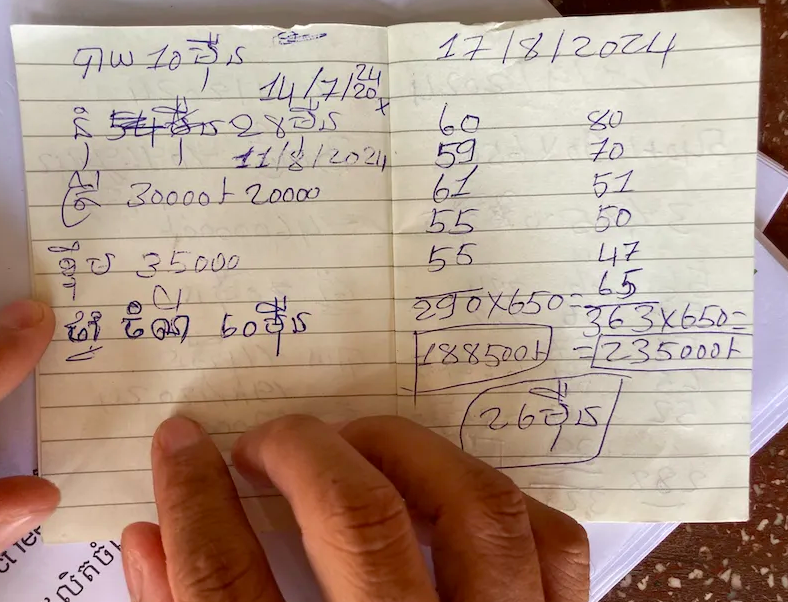
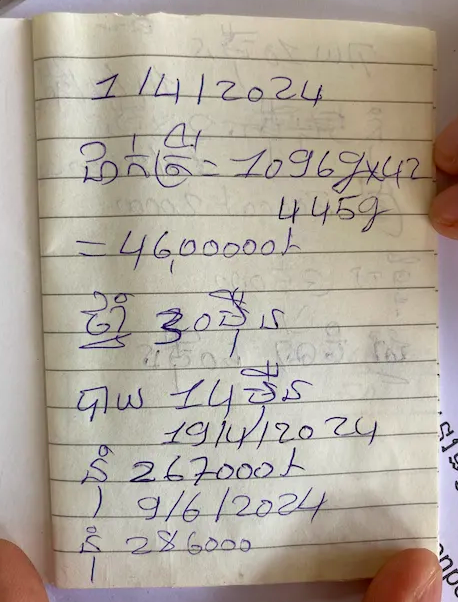

============================================
# <<課題について投稿する際に添えて欲しい内容>>

# 制作アプリのタイトル
　給餌記録アプリ

# 制作アプリの説明（40文字程度）
　カンボジア水産養殖業者が給餌記録をつけることができる。

# 工夫した点・こだわった点
　授業の内容を理解するのに手間取って基本的機能のみ制作した。
　実際にカンボジア養殖業者にヒアリングに行き、何を紙で記録しているのか項目を洗い出し、記録アプリに反映した。

# 次回トライしたこと（または機能）
　　削除と変更の機能を付けたい

# 備考（感想、シェアしたいこと等なんでも）
　農家にヒアリングの様子の写真です。

# ※今回もキャプションを撮っていただいて課題投稿に添えていただければと思います。
============================================

